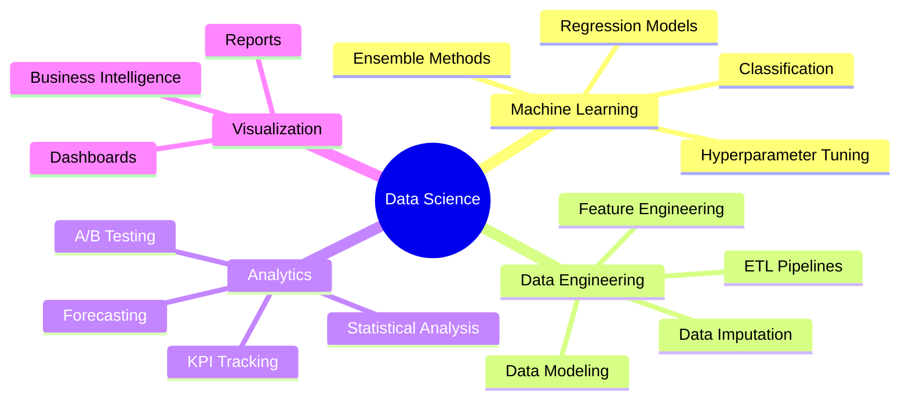

<div align="center">

# 👋 Hi, I'm Azam Mustufa Didagur

### Data Scientist | Machine Learning Engineer | Python Developer

[](YOUR_LINKEDIN_URL_HERE)
[](mailto:azammustafa66@gmail.com)
[](https://github.com/azammustafa66)

</div>

---

## 🚀 About Me

```python
class DataScientist:
    def __init__(self):
        self.name = "Azam Mustufa Didagur"
        self.role = "Data Scientist & ML Engineer"
        self.location = "India 🇮🇳"
        self.education = "B.E. in Computer Science & Engineering"
        self.university = "Visvesvaraya Technological University"
        
    def get_skills(self):
        return {
            'languages': ['Python', 'SQL', 'C/C++'],
            'ml_frameworks': ['Scikit-learn', 'XGBoost', 'TensorFlow'],
            'data_viz': ['Power BI', 'Tableau', 'Excel', 'Matplotlib', 'Seaborn'],
            'tools': ['Git', 'Jupyter', 'VS Code', 'MySQL'],
            'expertise': ['Machine Learning', 'Predictive Modeling', 
                         'Feature Engineering', 'Data Analysis']
        }
    
    def current_focus(self):
        return "Building end-to-end ML pipelines and solving real-world problems"

me = DataScientist()
```

---

## 🛠️ Tech Stack

<div align="center">

### Languages & Frameworks


### Machine Learning & Data Science


### Visualization & BI Tools


### Tools & Platforms


</div>

---

## 📈 GitHub Stats

<div align="center">
  


</div>

---

## 🎓 Certifications

<div align="center">

| Certificate | Issuer | Focus Area |
|------------|--------|------------|
| 📊 Google Data Analytics Professional | Google | Data Analysis & Visualization |
| 💾 SQL for Professionals | - | Database Management |
| 🧮 Math for Machine Learning | DeepLearning.ai | Linear Algebra & Calculus |
| 📈 Excel for Data Analysts | - | Advanced Excel Techniques |
| 🐍 Python Bootcamp | Codebasics | Python Programming |

</div>

---

## 🎯 Core Competencies



---

## 💡 What I'm Up To

- 🔭 Currently working on **ML projects and algorithmic trading systems**
- 🌱 Learning **deep learning architectures and model optimization techniques**
- 👯 Looking to collaborate on **open source ML/AI projects**
- 💬 Ask me about **Python, Machine Learning, Data Analysis, or Algorithmic Trading**
- ⚡ Fun fact: **I love diving deep into the mathematics behind ML algorithms!**

---

## 📫 Let's Connect!

<div align="center">

[](https://www.linkedin.com/in/azam20/)
[](mailto:azammustafa66@gmail.com)
[](https://github.com/azammustafa66)

### 💼 Open to Data Science & ML Engineering Opportunities!

</div>

---

<div align="center">

### 🌟 "Data is the new oil, but insights are the refined fuel that drives decisions" 🌟


</div>
